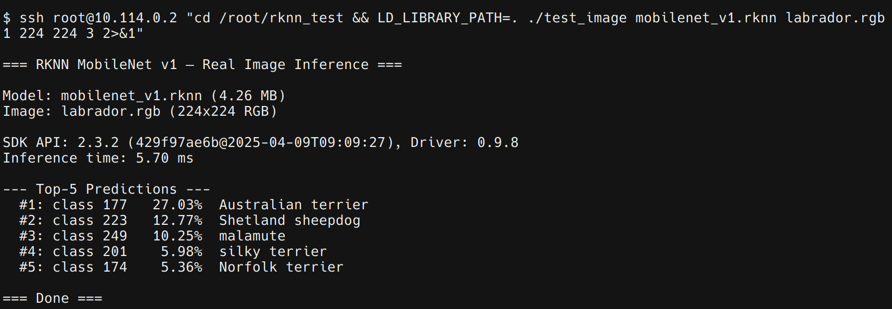

# rknpu-module

Out-of-tree kernel module for the Rockchip RKNPU driver, ported from the [rockchip-linux/kernel](https://github.com/rockchip-linux/kernel).

Tested on Armbian mainline kernel 6.19.x.



## 1. Tested Environment

| Item | Value |
|---|---|
| Board | OrangePi 3B v1.1 (RK3566) |
| OS | DietPi OS (Debian Trixie) |
| Kernel | 6.19.3-edge-rockchip64 |
| RKNN Runtime | librknnrt v2.3.2 |

## 2. Prerequisites

```sh
apt install dkms build-essential linux-headers-$whatever_your_kernel_is
```

## 3. Build & Install

This module can be built and installed using DKMS or manually. DKMS is preferred for ease of maintenance.

### 3.1. DKMS (Recommended)

```sh
# In the rknpu-module directory:
cp -r . /usr/src/rknpu-0.9.8

dkms add rknpu/0.9.8
dkms build rknpu/0.9.8
dkms install rknpu/0.9.8
```

DKMS automatically rebuilds the module on kernel updates.

### 3.2. Manual Build

If you want to cross-compile from an x86_64 host, set up a cross-compilation environment and point `KDIR` to the ARM64 kernel headers.

```sh
# a) Native build on the device
make
sudo make install
sudo depmod -a

# b) Cross-compile from an x86_64 host
make KDIR=/path/to/arm64-kernel-headers
```

## 4. Device Tree Modifications

Mainline DTBs do not include an NPU node.

See [`dts/rk3566-rknpu.dts`](dts/rk3566-rknpu.dts) for the full node definitions. At least the following 5 modifications are required to enable the NPU:

1. **NPU power domain**: add `power-domain@6` (PD_NPU) under the `power-controller` node.
2. **NPU device node**: add `npu@fde40000`.
3. **IOMMU node**: add `iommu@fde4b000` with `status = "disabled"` (see section 6.1).
4. **NPU OPP table**: add `npu-opp-table` node for devfreq DVFS support (see section 5.1).
5. **vdd_npu regulator**: add `regulator-always-on` to the PMIC `DCDC_REG4` node.

Workflow:

```sh
# 1. Fetch and decompile the DTB
scp root@<device>:/boot/dtb/rockchip/<board>.dtb device.dtb
dtc -I dtb -O dts device.dtb > device.dts

# 2. Edit device.dts following dts/rk3566-rknpu.dts
# Note: phandle values are board-specific — look them up in the decompiled DTS.

# 3. Recompile and deploy
dtc -I dts -O dtb -o device-modified.dtb device.dts
scp device-modified.dtb root@<device>:/boot/dtb/rockchip/<board>.dtb
# 4. Reboot!
```

## 5. Enabling the Driver and Verifying

```sh
modprobe rknpu

dmesg | grep rknpu
# Expected:
#   RKNPU fde40000.npu: RKNPU: rknpu iommu device-tree entry not found!, using non-iommu mode
#   [drm] Initialized rknpu 0.9.8 for fde40000.npu on minor X
#   RKNPU fde40000.npu: RKNPU: devfreq enabled, initial freq: 594000000 Hz, volt: 900000 uV

ls -l /dev/dri/renderD*
```

### 5.1. Devfreq (DVFS)

The driver supports dynamic voltage and frequency scaling via the standard Linux devfreq framework. When an OPP table is present in the DTB, the driver automatically registers a devfreq device at `/sys/class/devfreq/fde40000.npu/`.

Available frequencies (RK3566): 200 / 297 / 400 / 600 / 700 / 800 MHz.

```sh
# Check current frequency
cat /sys/class/devfreq/fde40000.npu/cur_freq

# List available frequencies
cat /sys/class/devfreq/fde40000.npu/available_frequencies

# Switch to manual frequency control
echo userspace > /sys/class/devfreq/fde40000.npu/governor
echo 800000000 > /sys/class/devfreq/fde40000.npu/min_freq
echo 800000000 > /sys/class/devfreq/fde40000.npu/max_freq

# Restore automatic governor
echo rknpu_ondemand > /sys/class/devfreq/fde40000.npu/governor
echo 200000000 > /sys/class/devfreq/fde40000.npu/min_freq
echo 800000000 > /sys/class/devfreq/fde40000.npu/max_freq
```

If the OPP table is missing from the DTB, devfreq is silently skipped and the NPU runs at the fixed clock rate set by `assigned-clock-rates` (600 MHz).

## 6. Known Issues

### 6.1. IOMMU Unusable

The RK3566 IOMMU v2 hardware cannot access page tables at physical addresses above 4 GB. The mainline `rockchip-iommu` driver (`iommu_data_ops_v2`) does not set `GFP_DMA32`, so page tables may be allocated in the 4 GB+ region, causing bus errors if IOMMU mode is enabled.

Adding `mem=3840M` to the kernel command line works around this (forces all allocations below 4 GB) at the cost of smaller RAM. The current approach is to disable IOMMU (`status = "disabled"` in DTB) and run in non-IOMMU mode. This is a bug in `drivers/iommu/rockchip-iommu.c` and cannot be fixed from an out-of-tree module.

### 6.2. Only Tested on RK3566

The driver code supports RK3568, RK3588, and other SoCs, but has only been tested on RK3566 (OrangePi 3B). Other SoCs require their own DTB modifications and testing.

## 7. FAQ

**Q: Why not just use [Rocket](https://gitlab.freedesktop.org/mesa/mesa/-/tree/main/drivers/accel/rocket)?**

Rocket only supports the RK3588 and newer SoCs. The NPU in RK3566/RK3568 has architectural differences, and the Rocket project has no plans to reverse-engineer support for it.

**Q: I'm not using DietPi OS. Will this work?**

As long as you are running a sufficiently recent Armbian kernel, this module should be distribution-agnostic.

## 8. See Also

- [DietPi#7301 — NPU support for OrangePi 3B](https://github.com/MichaIng/DietPi/issues/7301)

## 9. License

GPL v2, consistent with the original Rockchip driver source.
